# Design: beat-prism-webgl — full GL port of the effect pipeline

## Canonical Vocabulary

| Term | Definition |
|------|-----------|
| pass | One draw of a full-screen quad through a fragment shader: reads ≥1 texture, writes one framebuffer (or the screen). |
| pass plan | The ordered list of passes with their uniforms, computed each frame from the active set, pulses, band energies, and time. Pure function, unit-tested in Node without a GL context. |
| ping-pong | The texture/framebuffer pair a pass chain alternates between; the final write is drawn to the screen. |
| source texture | The per-frame upload of the video frame (or demo scene) the first pass reads. |
| feedback texture | A persistent texture carrying last frame's output for temporal effects (echo trails, time smear, motion ghost, droste). |
| sprite layer | Instanced-quad rendering for scene elements (particles, confetti, bolts, glyphs) drawn after the pass chain. |
| glyph atlas | A small offscreen 2D canvas where glyph characters are rasterized once, uploaded as a texture for the sprite layer. (Atlas *generation* may use Canvas2D; all *rendering* is GL.) |
| frame ring | The fixed-size circular buffer of recent output frames feeding freeze-frame and stutter-loop; becomes an array of GL textures (was an array of canvases). |
| heavy | Registry flag (unchanged from the fx-pack design) marking effects that need an extra full-frame pass; the conductor still deals ≤ 2 per hand. |
| active set | The effect ids currently rendering — the dealt hand under shuffle, the enabled pool when manual. Unchanged semantics from the fx-pack design. |

## Decisions

### Scope: full GL port (all 46 effects)
**Decision:** The entire pipeline — geometry, color, temporal, overlay, scene — renders in WebGL. No Canvas2D rendering remains in the hot path.
**Rationale:** One render path, maximum 4K60 headroom; chosen explicitly by the user over the hybrid option.
**Alternatives considered:** Hybrid (GL base + 2D overlay/scene layer) — smaller diff, declined; GL-filter-helper-only — least win, declined.

### Stack: raw WebGL2, zero dependencies
**Decision:** WebGL2 context, shaders as template literals, hand-rolled full-screen-quad + FBO plumbing (~150 lines, written once).
**Rationale:** Preserves the cabinet's single-file / file:// portability; all 46 effects need custom shaders anyway, so a framework only hides the pass structure this port exists to tighten. ~96% browser support.
**Alternatives considered:** PixiJS via CDN (faster sprites/text, ~450 KB dep, breaks offline purity); three.js via CDN (3D scene graph unneeded for 2D video passes).

### Canvas2D pipeline is deleted, not kept as fallback
**Decision:** GL-only. If `getContext('webgl2')` fails, show a clear "this experiment needs WebGL2" panel. On `webglcontextlost`/`restored`, rebuild GL state and continue.
**Rationale:** A kept 2D fallback doubles every future effect change and the file size. WebGL2 absence is vanishingly rare in 2026 browsers.
**Alternatives considered:** Full 2D fallback (double maintenance); `?2d` flag during the port then delete (extra ceremony for a single-session port).

### Visual parity bar: same vibe, GL-native
**Decision:** Every effect keeps its id, name, category, kind (pulse/continuous/scheduled), trigger semantics, and overall look — but shaders may render it *better* (true polar kaleidoscope, per-pixel posterize, real edge detection for neon-edge, gaussian glow instead of shadowBlur). No pixel-exact requirement.
**Rationale:** The validated feel is the contract; 2D quirks (shadowBlur cost, filter-stack rounding) are implementation details not worth mimicking.
**Alternatives considered:** Pixel-faithful first (slower, mimics 2D artifacts); free redesign (look drift risk).

### What does not change
**Decision:** The detection/beat layer is untouched: `__logic` block (flux, onset, BPM, grid, conductor, registry), HUD/drawer/transport DOM, keyboard map, fps diagnostics panel, audio graph. `FX_REGISTRY` stays the canonical effect list; the conductor still deals hands from it.
**Rationale:** That layer is pure, tested (280 green), and orthogonal to how pixels are produced.

### Pass plan is pure, tested logic
**Decision:** A new pure function in the `__logic` block with an explicit contract:
`buildPassPlan(input)` where `input = { active: Set<effectId>, pulses: Record<effectId, number 0..1>, bass: number 0..1, treble: number 0..1, tSec: number, scheduled: { mirrorOn, tileN, lbOpen, frozen, stutterBack } }` → ordered `Array<{ id: effectId, program: programKey, uniforms: Record<string, number|number[]> }>`.
It encodes render order (geometry → color → temporal → overlay), pulse gating (skip passes whose pulse decayed below threshold), and color-pass folding (light color effects collapse into ONE shader pass with combined uniforms, replacing the old `ctx.filter` stack). Shader GLSL itself is exercised by structure tests only (compiles deferred to the browser).
**Rationale:** Mirrors the repo convention — DOM-free math in `__logic`, Node-tested; the pass plan is exactly the "tighter pipeline" and deserves the strongest tests.

### Acceptance: measured by the fps panel
**Decision:** Done means the `f` diagnostics panel shows a full shuffle hand (including 2 heavies) on 4K60 source with fps ≥ 0.95 × refresh and no climbing drop total on the test machine; the panel's `draw` line should fall well below the Canvas2D baseline the user measures pre-port.
**Rationale:** The diagnostics shipped in PR #7 exist precisely to make this port's payoff observable.

## Visualizations

### Frame flow

```mermaid
flowchart LR
  V[video frame / demo scene] -->|texImage2D| S[source texture]
  S --> G[geometry pass\nzoom·shake·rotate·squash·skew·mirror·kaleido·tile·pixelate·slice]
  G --> C[color pass folded\nhue·sat·bleach·gamma·drain·posterize·invert·duotone·thermal·sepia·channel·neon·chroma·flash]
  C --> T[temporal passes\necho·smear·ghost·droste·strobe·freeze·stutter·interlace]
  T --> O[overlay pass\nglow·scanlines·vhs·grain·vignette·letterbox·starburst·shockwave]
  O --> P[ping-pong result → screen]
  P --> SL[sprite layer\nburst·confetti·lightning·glyphs]
  T <--> FB[(feedback textures)]
  FR[(frame ring textures)] --> T
```

## Edge Cases & Scenarios

- WebGL2 unavailable → full-screen "needs WebGL2" message; no silent black canvas.
- Context lost mid-show (GPU reset, tab backgrounded on mobile) → `webglcontextrestored` rebuilds programs/textures; feedback buffers restart empty (one-frame visual hiccup is acceptable).
- 4K source on a small canvas → source texture is uploaded at video resolution but passes run at canvas resolution; no full-res intermediate buffers.
- Resize → FBOs reallocated, feedback textures cleared (same semantics as today's `resize()` dropping the ring).
- Freeze-frame / stutter-loop ring → becomes a small array of textures; capture pauses while frozen, exactly like the 2D ring.
- Tainted-canvas concern does not apply (local files only), but `s` save-PNG must read from the GL canvas via `preserveDrawingBuffer: false` + capture-on-demand render.

## Q&A Summary

**Q:** How far should the WebGL pass reach into the 46-effect pipeline — hybrid, full port, or GL filter helper?
**A:** Full GL port — all 46 effects.

**Q:** What does the GL port build on — raw WebGL2, PixiJS, or three.js?
**A:** Raw WebGL2, no dependencies, single-file preserved. (Asked twice across a session restart; same answer both times.)

**Q:** Does the Canvas2D pipeline survive as a fallback?
**A:** No — GL-only, delete the 2D pipeline; clear message when WebGL2 is missing; rebuild on context loss.

**Q:** What's the visual parity bar for the ported effects?
**A:** Same vibe, GL-native — keep identity and trigger semantics, allow shader-quality upgrades, no pixel-exactness.
