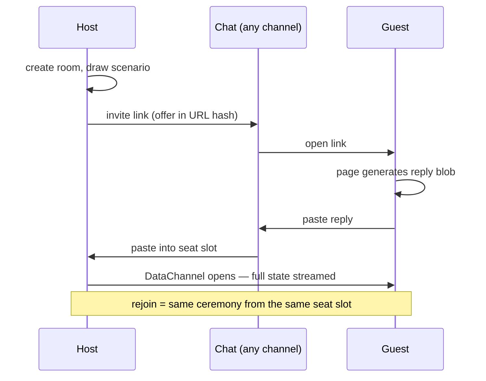
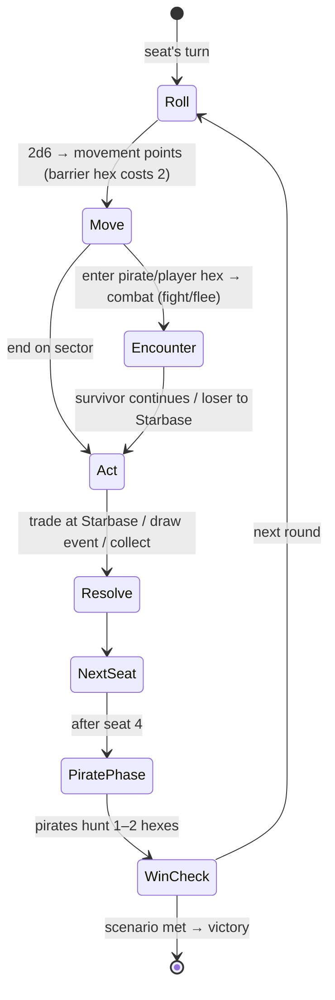

# Design: star-freight — sci-fi trading board game, 4-player P2P

## Canonical Vocabulary

| Term | Definition |
|------|-----------|
| room | One game session: a host plus up to 3 guests connected by WebRTC DataChannels in a star around the host. |
| invite | A host-generated WebRTC offer blob (compressed base64, carried in a shareable URL hash), one per seat. The host's room screen always shows a current invite link per open seat — rejoin uses the same place and same UX (technically a fresh blob each time; WebRTC offers are one-shot). |
| reply | The guest's answer blob, sent back to the host out-of-band (paste or QR). Completes that seat's connection. |
| seat | A player slot (1–4). Host always holds seat 1. A seat is held by a human, a bot, or is dormant. |
| host | The room creator. Runs the authoritative rules engine; relays all state. Host disconnect ends the game. |
| intent | A guest's proposed action ("roll", "buy 3 ore", "fight", "flee"). Only the host turns intents into state changes. |
| Space Bucks | The currency. Earned by trading cargo, bounties, and events. |
| Starbase | A station hex: market (buy/sell cargo), shipyard (buy upgrades/equipment/crew), respawn point after defeat. |
| sector | One hex on the board. Kinds: starbase, planet, asteroid, nebula, deep space, core. |
| ring barrier | A concentric band of nebula/barrier sectors. Difficult terrain: entering costs extra movement ("slows warping"). Rings separate rim → mid → core. |
| scenario | A card drawn at room setup that sets this game's win condition (e.g., "amass 5,000 Space Bucks", "defeat 4 pirates", "score 2 ship kills"). One scenario per game, visible to all. |
| mods | A ship's accumulated bonuses from upgrades, equipment, and crew cards. Added to combat and sometimes movement rolls. |
| pirate | An NPC ship. Spawned by event cards; hunts players each round (host-moved 1–2 sectors toward the nearest player ship); fights with the same opposed-roll combat. |
| event | A card drawn when a ship ends movement on an event-bearing sector. Effects: pirate spawns, market shocks, windfalls, hazards. |

## Decisions

### Networking: manual WebRTC invites, zero dependencies
**Decision:** Pure browser WebRTC with manual signaling — no signaling server, no CDN library. The host generates one invite per guest; the guest opens the invite link (offer rides in the URL hash), the page produces a reply blob, the guest sends it back out-of-band, the host pastes it in, and the DataChannel opens.
**Rationale:** User choice. Keeps the cabinet's zero-dependency, single-file, no-server ethos intact while allowing true cross-device play. The copy-paste join ceremony is the accepted trade-off.
**Alternatives considered:** P2P via CDN signaling lib (trystero — smooth room codes, first runtime dependency); hot-seat + BroadcastChannel tabs (zero-dep but same-device only).

### Topology: star around the host
**Decision:** Guests connect only to the host. 4 players = 3 invite/reply exchanges, each involving only the host and one guest.
**Rationale:** Full mesh under manual signaling needs O(n²) blob exchanges — unusable. The star makes each join exactly one paste round-trip.
**Alternatives considered:** Full mesh (rejected: 6 manual exchanges for 4 players).

### Authority: host-authoritative rules engine
**Decision:** The host is the single source of truth. Guests send intents; the host validates against the rules, advances state, and broadcasts the full new state on every change. The engine core is one pure function `applyIntent(state, seat, intent) → state'`.
**Rationale:** Forced by the star topology; eliminates desync; makes rejoin a free state transfer; makes the whole ruleset Node-testable without a browser or network.
**Alternatives considered:** Deterministic lockstep with seeded RNG everywhere (fragile under loss, no mid-game rejoin without state transfer anyway).

### Win conditions: scenario deck
**Decision:** At room setup the host draws (or picks) one scenario card from the scenario deck; it sets this game's single, visible win condition — economic (amass N Space Bucks), bounty (defeat N pirates), military (N player-ship kills), and similar.
**Rationale:** User direction. Same engine, pluggable victory checks — one `checkWin(state, scenario)` function — and high replay variety for little engine cost.
**Alternatives considered:** Fixed race to a fortune; fixed round count, richest wins; contract-delivery runs (all subsumable as future scenario cards).

### Combat: opposed roll + earned mods, Talisman-style defeat
**Decision:** One mechanic for PvP and pirates: attacker and defender each roll 2d6 + their mods (ship upgrades, equipment, crew — all earned in game); higher total wins, ties defender. The loser loses one random asset (upgrade, equipment, crew, or cargo lot — winner scoops cargo; cards go to a discard) and restarts at the nearest Starbase. No hull points, no permadeath.
**Rationale:** User choice ("Talisman style"). Single-roll resolution keeps turns fast over the wire; the random-loss table makes defeat sting without bookkeeping.
**Alternatives considered:** Hull points with multi-round combat (more state, slower turns); PvE-only (loses ship-kill scenarios).

### Board: hex sectors with concentric ring barriers
**Decision:** A hex-sector starmap arranged in concentric rings — outer rim (safe, Starbases), nebula ring barriers between rings (difficult terrain: entering costs 2 movement instead of 1), richer and more dangerous toward the core. Movement: roll dice for movement points, spend them hex by hex along a path you choose.
**Rationale:** User direction — hex freedom plus Talisman's ring gradient. Barriers create routing decisions (pay the slow toll or go around) and natural danger tiers without gates or special rules.
**Alternatives considered:** Point-to-point starmap (fewer UI costs, less spatial freedom); pure concentric rings (movement too railroaded).

### Pirates: event-spawned hunting packs
**Decision:** Pirates enter the board via event cards (and scenario setup). At the end of each round the host moves every pirate 1–2 sectors toward the nearest player ship (simple greedy hex pathing, slowed by barriers like everyone else); contact forces combat. Defeated pirates pay a bounty and leave the board.
**Rationale:** User choice combining both grill options: events control the spawn rate, the hunt makes the board feel alive and the rings matter.
**Alternatives considered:** Static lair ambushers (no AI, but passive); event-card-only raiders (no board presence).

### Disconnects: re-invite with same-link UX, or botify
**Decision:** A dropped guest's ship goes dormant; the host's room screen keeps showing that seat's invite link — grabbing and sending it again re-runs the paste ceremony and streams full state back into the seat. Alternatively the host can hand the seat to a bot with one click. Host disconnect ends the game (stated honestly to guests).
**Rationale:** User choice ("same link should work, or turn player into simple bot"). The link is regenerated under the hood (WebRTC offers are one-shot) but lives in the same place with the same UX.
**Alternatives considered:** Drop-is-elimination (one flaky phone ruins the game).

### Bots fill empty seats
**Decision:** The simple bot required for disconnect handling (conservative trader/fighter: moves toward profitable trades, fights only when cornered or clearly stronger) can also fill any empty seat at room creation. A solo host + 3 bots is a complete game.
**Rationale:** The bot must exist anyway; seat-filling is trivial reuse and makes the experiment demoable by a single gallery visitor — essential for the cabinet.
**Alternatives considered:** Multiplayer-only (un-demoable solo); no bots (disconnects stall the game).

## Visualizations

### Join ceremony (per guest)



### Board shape

```
        rim: Starbases, safe trade        ░ = nebula ring barrier (move cost 2)
   ░░░░░░░░░░░░░░░░░░░░░░░░░░░░░          core: rare cargo, bounty hexes,
  rim   ░░░  mid  ░░░  CORE  ░░░  rim     event density rises inward
   ░░░░░░░░░░░░░░░░░░░░░░░░░░░░░
```

### Turn flow (host-resolved)



## Edge Cases & Scenarios

- Guest opens an invite link twice → second open generates a different reply; host pastes whichever arrives — the other is dead. One seat, one channel.
- Reply pasted into the wrong seat slot → host-side validation rejects a reply that doesn't match that seat's pending offer.
- Player defeated with zero assets → loses nothing, still respawns at nearest Starbase (no negative spiral).
- Two pirates equidistant from two ships → deterministic tie-break (lowest pirate id, lowest seat) so host recomputation is reproducible.
- Bot's turn when all humans disconnected except host → game continues; bots play instantly with a short artificial delay for watchability.
- Scenario met by two players in the same round → first to satisfy it during the host's resolution order wins (turn order is the tie-break).
- Guest joins mid-ceremony when the game already started (late 4th player) → allowed until round 3, then seats lock to bots/dormant.
- URL-hash invite exceeds practical link length → offer is compressed (SDP munged + deflate via CompressionStream); fallback shows the raw blob for manual copy.

## Q&A Summary

**Q:** How should 4-player rooms connect, given the zero-dep/no-server repo ethos?
**A:** Manual WebRTC invites — copy-paste signaling, cross-device P2P, zero dependencies. Star topology and host authority follow as forced moves.

**Q:** Core loop and win condition?
**A:** Scenario deck — each game draws a card setting the win condition: make enough Space Bucks, defeat enough pirates, player-ship kills, etc.

**Q:** Combat resolution?
**A:** Opposed roll with modifiers earned in game (ship/equipment/crew); when defeated, lose a random upgrade/cargo/crew (Talisman style) and start over at the nearest Starbase.

**Q:** Board topology?
**A:** Hex sectors with concentric nebula/barrier rings as difficult terrain that slows warping.

**Q:** How do NPC pirates live on the board?
**A:** Hunting packs, spawned by event cards.

**Q:** Disconnect policy?
**A:** Host can re-invite (same link UX) or turn the player into a simple bot; host disconnect ends the game. Bots also fill empty seats at creation (recorded as a decision, follows from the bot existing).
